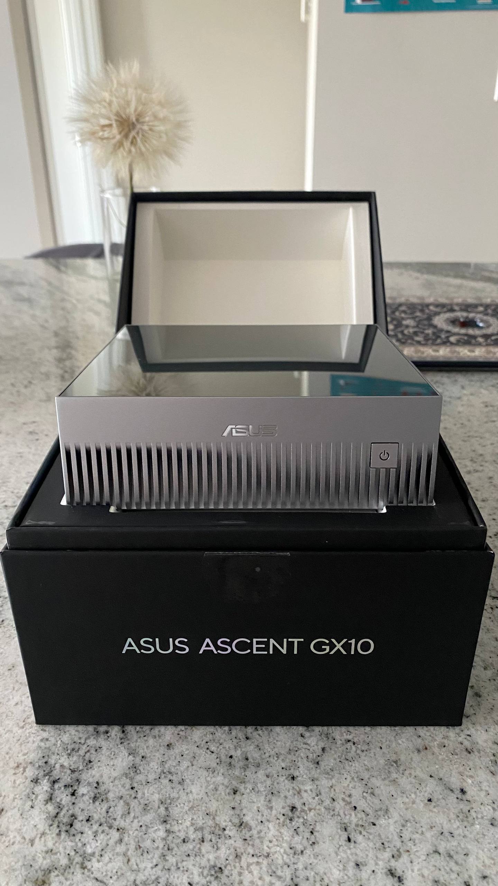
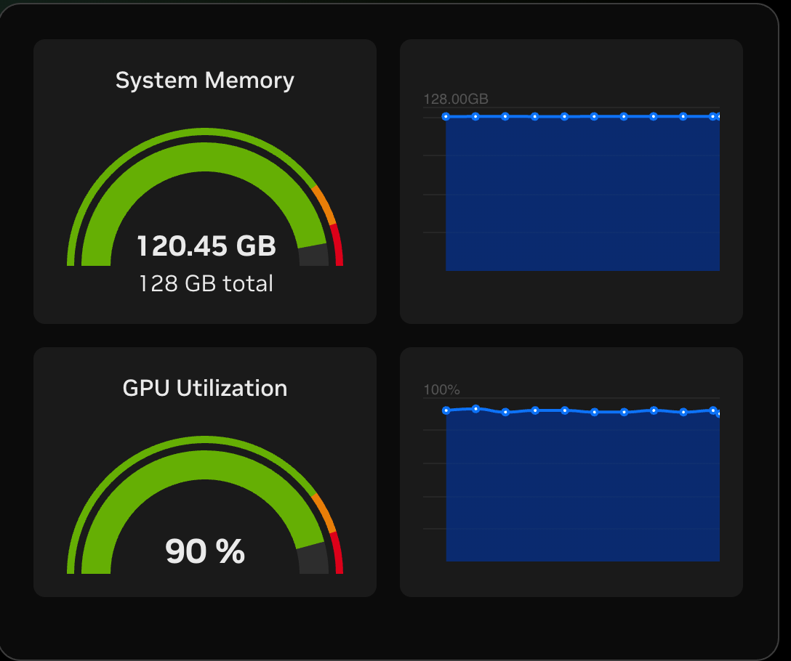
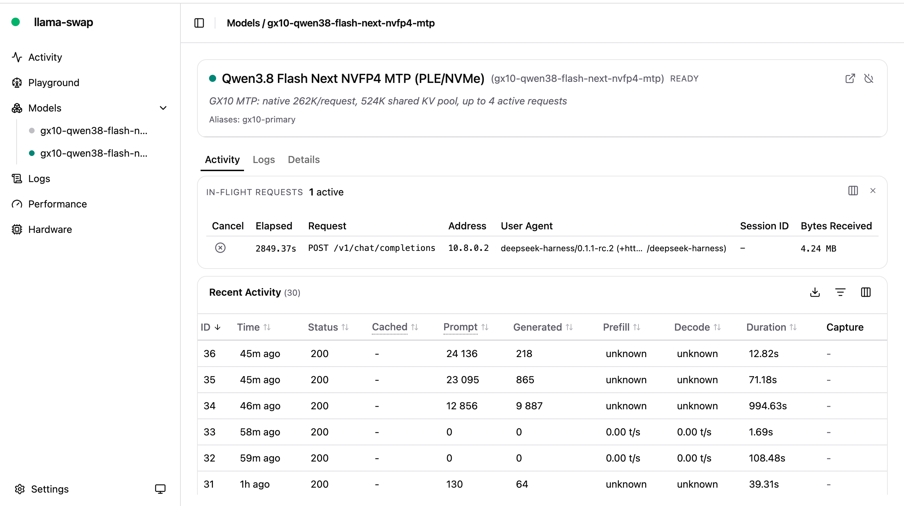

# Qwen3.8-Flash-Next on one DGX Spark

Run `RadixArk/Qwen3.8-Flash-Next-NVFP4` with native 262K context and MTP on a
single 128 GB NVIDIA GB10 system. The launch path keeps the model's 51.2 GB
PLE/n-gram table on NVMe instead of consuming unified memory.

Validated on an **ASUS Ascent GX10**. The NVIDIA DGX Spark uses the same GB10
architecture and 128 GB unified memory; DGX Spark confirmations are welcome.

<p align="center">
  
</p>

## Verified result

| Item | Result |
|---|---:|
| Model | Qwen3.8-Flash-Next NVFP4 |
| Main / active parameters | 125B / 6B per token |
| Additional PLE n-gram table | 51B parameters, 51.2 GB FP8 mmap on NVMe |
| Speculative decoding | Native MTP / NEXTN, official MTP-213 profile (2 steps, top-k 1, 3 draft tokens) |
| Context per request | 262,144 tokens (native) |
| Shared KV pool | 524,288 BF16 tokens |
| Active requests | Up to 4; two can each consume a full 262K window |
| Single-stream decode | 32.7 output tokens/s steady-state |
| Four-stream batch | 93.0–93.4 output tokens/s aggregate, observed peak 103.36 |
| Resident system memory | 120.45 / 128 GB including the OS |
| GPU utilization during generation | ~90% |
| Cold load | About 9.5 minutes |

<p align="center">
  
  
</p>

These are measurements from the included pinned checkpoint and launch path,
not estimates copied from another GPU.

The launch profile follows [SGLang's official **MTP-213** recommendation](https://www.lmsys.org/blog/2026-08-26-qwen-flash-next/)
for Qwen3.8-Flash-Next: 2 speculative steps, top-k 1 and 3 draft tokens. In two
repeated four-request batches, each request sustained about 23.6–23.8 output
tokens/s while sharing the same server.

The structured measurement record is available in
[`benchmarks/asus-ascent-gx10-2026-08-26.json`](benchmarks/asus-ascent-gx10-2026-08-26.json).

## Why this patch is needed

The NVFP4 checkpoint is 135.24 GB. Stock PLE host offload still places the
entire 51.2 GB table in host memory, but host memory and VRAM are the same 128 GB
pool on GB10. That leaves insufficient room for the remaining weights, runtime,
KV cache and operating system.

This repository adds two source-hash-guarded patches to a pinned SGLang image:

1. A verified raw FP8 mmap keeps the full PLE table on NVMe. A bounded 256 MiB,
   four-way pinned row cache serves decode lookups; large prefill lookups bypass
   it.
2. QSA decode uses a PyTorch SDPA fallback on SM121 because the pinned
   FlashAttention-4 varlen path does not compile correctly on GB10.

Decode runs eagerly because disk-fed PLE rows cannot safely be captured as fixed
host pointers in a CUDA graph. The source patches stop the image build if the
upstream SGLang files no longer match their expected SHA-256 hashes.

## Requirements

- NVIDIA DGX Spark or another NVIDIA GB10 / SM 12.1 system with 128 GB unified
  memory (ASUS Ascent GX10 tested)
- AArch64 Linux with a working NVIDIA driver, Docker Engine and NVIDIA Container
  Toolkit
- At least **230 GB free NVMe space** for the checkpoint, derived PLE mmap,
  container image and caches
- No other GPU model loaded while Flash Next is running
- `curl`, `docker`, `nvidia-smi` and Bash 4+

The model weights are downloaded directly from Hugging Face and are never
stored in this repository.

## Quick start

```bash
git clone https://github.com/Felliks/qwen38-flash-next-one-dgx-spark.git
cd qwen38-flash-next-one-dgx-spark
chmod +x run-spark.sh

./run-spark.sh prepare
./run-spark.sh serve
./run-spark.sh logs
```

`prepare` performs four reproducible steps:

1. Builds the pinned SGLang image with the guarded PLE and SM121 patches.
2. Downloads the exact NVFP4 checkpoint revision.
3. Converts the checkpoint's 128 FP8 PLE shards into a contiguous 51.2 GB mmap.
4. Compares 256 deterministic mmap rows byte-for-byte with the safetensors
   source.

The first model load takes about ten minutes. In a second terminal:

```bash
./run-spark.sh smoke
./run-spark.sh status
```

The OpenAI-compatible endpoint is available at:

```text
http://127.0.0.1:8000/v1
```

The served model name is:

```text
qwen38-flash-next-nvfp4-mtp
```

Stop it cleanly with:

```bash
./run-spark.sh stop
```

## Exact inference configuration

The launch script uses:

```text
quantization:              ModelOpt NVFP4 W4A4 routed experts
FP4 backend:               FlashInfer CUTLASS
KV cache:                  BF16
context length:            262144
shared token pool:         524288
max running requests:      4
chunked prefill:            4096
static memory fraction:    0.95
Mamba cache paths:         20
MTP algorithm:             NEXTN
MTP profile:               213 (2 steps / top-k 1 / 3 draft tokens)
PLE row cache:              256 MiB
```

Thinking-mode sampling defaults match the Qwen model card:

```text
temperature=1.0, top_p=0.95, top_k=20, min_p=0.0,
presence_penalty=0.0, repetition_penalty=1.0
```

For non-thinking/instruct requests, set these per request:

```text
temperature=0.7, top_p=0.80, top_k=20, min_p=0.0,
presence_penalty=1.5, repetition_penalty=1.0
```

## Configuration overrides

All persistent data defaults to `./data`, which is ignored by Git.

```bash
# Change the local API port
API_PORT=31000 ./run-spark.sh serve

# Use separate storage on a large NVMe volume
QWEN_NEXT_DATA_DIR=/mnt/nvme/qwen38-next ./run-spark.sh prepare
QWEN_NEXT_DATA_DIR=/mnt/nvme/qwen38-next ./run-spark.sh serve

# Override CPU affinity if required
CPUSET=0-19 ./run-spark.sh serve
```

The default bind address is `127.0.0.1`. Do not expose the unauthenticated
SGLang endpoint to the public internet. If a trusted LAN bind is required, use
`BIND_ADDR=0.0.0.0` only behind a firewall or authenticated reverse proxy.

## Pinned components

| Component | Pin |
|---|---|
| Model | `RadixArk/Qwen3.8-Flash-Next-NVFP4` |
| Model revision | `7b719225242aacd3dbd3f9407468c2ee9a9d2594` |
| SGLang image | `lmsysorg/sglang@sha256:14ed582518584c5c830206b5318a2c2769e68229c3422e48a28b952b3a888bd4` |
| SGLang image commit | `d91c3682b0b429e4c70df63cd57f819588ce29b0` |
| Qwen4 experimental source | `73a255206f916366c8d26d4022f82ddfb0ab558d` |

## Known limitations

- The disk-backed PLE path is currently restricted to tensor parallel size 1.
- Decode uses eager execution and an SM121 SDPA QSA fallback.
- BF16 KV is intentional; the tested SM121 eager QSA path rejects FP8 K/V
  tensors.
- Four active requests share 524K tokens. Four simultaneous 262K contexts do
  not fit; use two full contexts or four shorter ones.
- This is a new model architecture and a pinned candidate NVFP4 checkpoint.
  Re-run validation before changing model or SGLang revisions.

## License and attribution

The code in this repository is licensed under Apache-2.0. SGLang is an
Apache-2.0 project. Model weights are not redistributed and remain subject to
the [Qwen Community License 1.0](https://huggingface.co/Qwen/Qwen3.8-Flash-Next/blob/main/LICENSE).

Model and upstream projects:

- [Qwen/Qwen3.8-Flash-Next](https://huggingface.co/Qwen/Qwen3.8-Flash-Next)
- [RadixArk/Qwen3.8-Flash-Next-NVFP4](https://huggingface.co/RadixArk/Qwen3.8-Flash-Next-NVFP4)
- [SGLang](https://github.com/sgl-project/sglang)

This project is independent and is not affiliated with NVIDIA, ASUS, Qwen,
RadixArk or the SGLang maintainers.
